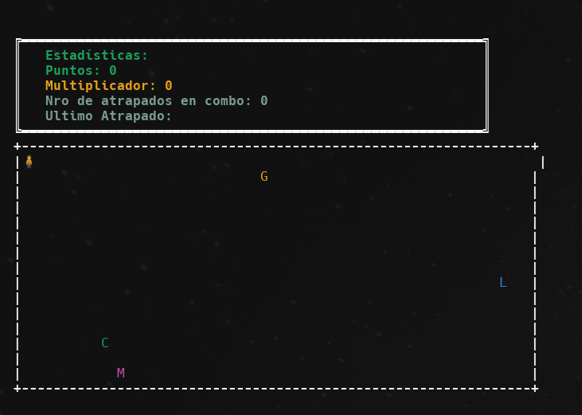

# Pokegame

---
### **Ejecución**:
```bash
make
```

### **Ejecución con Valgrind**:
```bash
make run-valgrind
```

---

## **Introducción**

Este project implementa un juego basado en la captura de Pokémon en un entorno controlado dentro de la terminal. Se utilizan una arquitectura de archivos y logica que promueve el mantenimiento del codigo, diseño modular y manejo de TDAs.

El juego se da un escenario de terminal jugandose a través de movimientos estratégicos, donde se deben capturar Pokémon generados aleatoriamente en un tablero de dimensiones **32x15**. Las interacciones del jugador y las mecánicas del juego están diseñadas para promover una buena experiencia para el jugador pero tambien para ponerle un reto que debe cumplir en **60 segundos**.


---

## **Estructura del Programa**

### Diseño General
El programa se organiza en módulos independientes que se comunican a través de funciones específicas y estructuras compartidas de manera controlada. Esto asegura encapsulamiento, estructura de caja negra para cada TDA, mantenimiento sencillo y adaptabilidad a nuevas funcionalidades.

### **Módulos Principales**
El programa está compuesto por los siguientes TDAs y módulos:

1. **TDA Juego**
   Coordina el flujo general del juego, incluyendo:
   - Gestión del tiempo.
   - Actualización del estado del tablero.
   - Control de eventos como capturas y finalización.

2. **TDA Tablero**
   Representa la estructura física donde se desarrolla el juego.
   - Almacena las posiciones de Pokémon y del jugador.
   - Coordina movimientos y verifica capturas.

3. **TDA Pokedex**
   - Administra la lista de Pokémon disponibles en el juego.
   - Facilita la generación aleatoria y la visualización ordenada de Pokémon.

4. **Módulo CSV**
   - Carga y lectura de archivos de datos.
   - Permite la reutilización de información externa.

5. **TDA Menú**
   - Gestión de opciones principales del juego.
   - Encapsula la lógica de interacción usuario-programa.

---

## **Explicación de los TDAs**

### **1. TDA Juego**
**Propósito**:
Gestión principal del flujo y lógica del juego.

**Estructura Interna**:
- **Tablero**: Administra la ubicación del jugador y Pokémon.
- **Pokédex**: Contiene los datos de los Pokémon disponibles.
- **Estado del Juego**: Tiempo inicial, puntaje, multiplicador y estadísticas.

**Funciones Principales**:
- `juego_crear`: Inicializa el TDA.
- `juego_iniciar`: Configura las condiciones iniciales.
- `juego_correr`: Ejecuta el bucle principal del juego, actualizando el tablero y controlando eventos.
- `juego_mostrar_resultados`: Imprime las estadísticas finales del jugador.

---

### **2. TDA Tablero**
**Propósito**:
Gestión del espacio físico del juego.

**Estructura Interna**:
- **Dimensiones**: 32x15.
- **Entidades**: Almacena las posiciones de Pokémon y jugador.

**Funciones Principales**:
- `tablero_crear`: Inicializa el tablero vacío.
- `tablero_esta_capturado`: Verifica la captura de un pokemon por el jugador
- `tablero_mover_jugador`: Procesa movimientos del jugador en el tablero.
- `tablero_mover_pokes`: Coordina movimientos de los Pokémon según patrones definidos.
- `tablero_mostrar`: Imprime el estado del tablero.

---

### **3. TDA Pokedex**
**Propósito**:
Administra los datos de los Pokémon en el juego.

**Estructura Interna**:
- **Lista Enlazada**: Almacena los Pokémon ordenados alfabéticamente.
- **Hash Map**: Asocia características únicas de los Pokémon, como color y nombre.

**Funciones Principales**:
- `pokedex_crear`: Inicializa la estructura.
- `pokedex_cargar_desde`: Lee los datos de Pokémon desde un archivo CSV.
- `pokedex_agregar_random`: Selecciona Pokémon al azar para colocarlos en el tablero.
- `pokedex_mostrar`: Imprime el contenido de la Pokédex ordenado.

---

### **4. Módulo CSV**
**Propósito**:
Carga de datos externos desde archivos en formato CSV.

**Funciones Principales**:
- `csv_abrir`: Abre y valida el archivo CSV.
- `csv_leer_fila`: Procesa una fila del archivo en formato clave-valor.
- `csv_cerrar`: Libera los recursos asociados.

---

### **5. TDA Menú**
**Propósito**:
Interacción principal entre el usuario y las opciones del programa.

**Funciones Principales**:
- `menu_crear`: Inicializa el menú.
- `menu_agregar`: Agrega una opción con su acción asociada.
- `menu_accion`: Ejecuta la función asociada a una opción seleccionada.
- `menu_destruir`: Libera los recursos.
- `menu_print`: Muestra el menu por pantalla.
---

## **Reutilización de TDAs**

- **Lista Enlazada**:
  Utilizada en `Pokedex` para mantener Pokémon ordenados alfabéticamente.
  - **Ventaja**: Inserciones y eliminaciones eficientes.

- **Árbol Binario de Búsqueda (ABB)**:
  Utilizado para el almacenamiento y búsqueda de Pokémon por nombre.
  - **Ventaja**: Optimiza las consultas y ordena por nombre.

- **Hash Map**:
  Implementado para asociar atributos únicos (por ejemplo, colores) a cada Pokémon.
  - **Ventaja**: Búsquedas rápidas.

---

## **Pruebas y Validación**

### **Pruebas Unitarias**
Se desarrollaron pruebas para cada TDA:
- **Juego**: Verificación del flujo y finalización correcta.
- **Tablero**: Validación de movimientos y capturas.
- **Pokédex**: Pruebas de carga y ordenamiento.
- **CSV**: Validación de archivos malformados y correctos.
- **Menú**: Verificación de interacciones válidas e inválidas.

---

## **Conclusión**

El proyecto demostró la utilidad de aplicar conceptos avanzados como diseño modular y abstracción. La correcta organización del código permitió un desarrollo limpio y eficiente. Este enfoque asegura una base sólida para futuras expansiones o adaptaciones del juego.

---

## Diagrama de Arquitectura

```plaintext
+---------------------+
|        Juego        |
|---------------------|
| - Tablero           |
| - Pokedex           |
| - Tiempo inicio     |
|---------------------|
| + juego_iniciar()   |
| + juego_correr()    |
| + juego_mostrar     |
|     resultados()    |
+---------------------+

+---------------------+
|       Tablero       |
|---------------------|
| - Jugador           |
| - Lista de Pokémon  |
|---------------------|
| + mover_jugador()   |
| + mover_pokemon()   |
| + mostrar_tablero() |
+---------------------+

+---------------------+
|       Pokedex       |
|---------------------|
| - Lista de Pokémon  |
|---------------------|
| + cargar_desde()    |
| + agregar_random()  |
| + mostrar()         |
+---------------------+

+---------------------+
|       Menu          |
|---------------------|
| - Lista de Pokémon  |
|---------------------|
| + menu_agregar()    |
| + menu_accion()     |
| + menu_print()      |
+---------------------+
```
